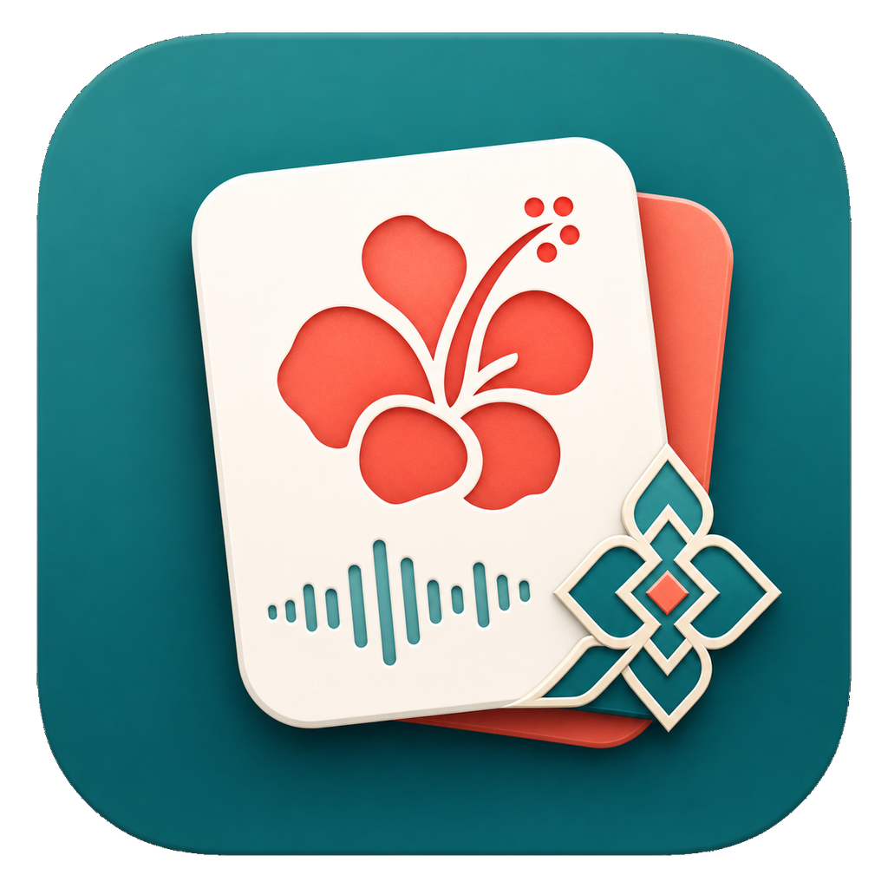

# MalayMate

MalayMate is a native macOS companion for learning Malay from Chinese. It is built for the daily rhythm that actually makes vocabulary stick: meet a small batch of new words, hear them immediately, send them into review, and let the app bring them back before they fade.

It is not a deck museum. It is a study cockpit.



## What It Does

- **Learn a controlled daily batch.** Choose how many new words you want today, then work through them one by one instead of drowning in the full dictionary.
- **Fight forgetting with review scheduling.** Learned words enter a Leitner-style spaced review queue. `Again`, `Good`, and `Easy` change when the card comes back.
- **Practice both directions.** Every bundled word becomes Malay -> Chinese and Chinese -> Malay cards, so recognition and recall train together.
- **Hear the word when it appears.** New words auto-play with the best Malay voice installed in macOS. You can also replay pronunciation manually.
- **Browse the whole library.** Search, filter by learning status, sort, expand examples, and inspect the full vocabulary bank without leaving the app.
- **Add your own words.** Save a Malay term, Chinese meaning, and note. If an OpenAI API key is configured, MalayMate can enrich the entry; otherwise it falls back to a local template.
- **Stay local by default.** Studying, review state, bundled content, and system speech run on your Mac. The AI path is optional and only used for user-added word enrichment.

## The Vocabulary Engine

MalayMate ships with a 3,000-word open-dictionary starter library, built from a frequency-ranked Malay selection extracted from Kaikki/Wiktionary-style data, plus a tiny hand-written starter set. On first launch, the importer turns those words into local SwiftData records and creates review cards for both study directions.

The current bundled seed content is:

- `Open Dictionary Malay 3000`: 3,000 frequency-ranked Malay entries with Chinese meanings, parts of speech, pronunciation notes where available, and local examples.
- `Starter Basics` and `Starter Food`: 6 small starter words for sanity checks and first-use flow.

That gives the app 3,006 bundled words and 6,012 initial review cards.

## The Study Loop

1. **Today** shows the pressure gauge: due reviews, words learned today, remaining new-word slots, and available new words.
2. **Learn** introduces new vocabulary up to your daily limit. Marking a word as learned sends it into the review queue, with the first check due after 10 minutes.
3. **Review** pulls due cards, lets you reveal answers, checks Chinese -> Malay spelling attempts, and schedules the next encounter.
4. **Library** stays as the map: all words, all statuses, all examples, searchable when you want to wander.
5. **Add Word** lets personal vocabulary enter the same system as the bundled library.

## Audio

Pronunciation uses `AVSpeechSynthesizer` and the Malay voice already installed on macOS. MalayMate looks for an exact `ms-MY` voice first, then any Malay voice, then a voice named Malay or Melayu.

If macOS has no Malay voice installed, audio controls are disabled instead of pretending to speak Malay badly.

## AI Assistance

AI is optional. In Settings, you can save an OpenAI API key in Keychain and choose a model name. When adding a custom word, MalayMate can ask the model for enrichment such as meaning, part of speech, pronunciation notes, syllables, and examples.

No API key means no problem: the app saves the word with a local fallback template.

## Build And Run

### macOS

Requirements:

- macOS 14 or newer
- Swift 6 toolchain

Build the Swift package:

```bash
swift build
```

Run tests:

```bash
swift test
```

Build a signed local `.app` bundle:

```bash
scripts/build_app_bundle.sh
```

The script creates `build/MalayMate.app`, with the real bundle staged under `/private/tmp` to avoid FileProvider extended-attribute issues during codesign verification.

### Android

The Android port lives in `Android/` and is built with the Android command-line tools, JDK 17, and Gradle.

Run unit tests:

```bash
cd Android
JAVA_HOME=/opt/homebrew/opt/openjdk@17/libexec/openjdk.jdk/Contents/Home \
ANDROID_HOME=/opt/homebrew/share/android-commandlinetools \
gradle testDebugUnitTest
```

Build and install a debug APK on a connected device:

```bash
cd Android
JAVA_HOME=/opt/homebrew/opt/openjdk@17/libexec/openjdk.jdk/Contents/Home \
ANDROID_HOME=/opt/homebrew/share/android-commandlinetools \
gradle assembleDebug
adb install -r app/build/outputs/apk/debug/app-debug.apk
```

## Content Pipeline

The bundled large deck is generated by:

```bash
scripts/build_starter_deck.py
```

Input files live in `content/raw/`, generated output lives in `content/generated/`, and app-bundled resources live in `Sources/MalayMateCore/Resources/`.

The included open dictionary content is useful for personal learning, but source-specific terms should be reviewed before redistribution.

## Project Shape

- `Sources/MalayMate`: SwiftUI app shell and views.
- `Sources/MalayMateCore`: learning, review, content, AI, speech, settings, and persistence logic.
- `Tests/MalayMateCoreTests`: focused tests for scheduling, import, library browsing, spelling, settings, speech selection, and content generation.
- `Android`: native Android app that ports the same local deck, study, review, library, add-word, settings, AI, and speech flows.
- `packaging`: app metadata and icon assets.

## Status

MalayMate is a personal macOS learning app in active development. The core loop is in place: learn new words, hear them, review them scientifically, browse the library, and add your own vocabulary when life hands you a word worth keeping.
